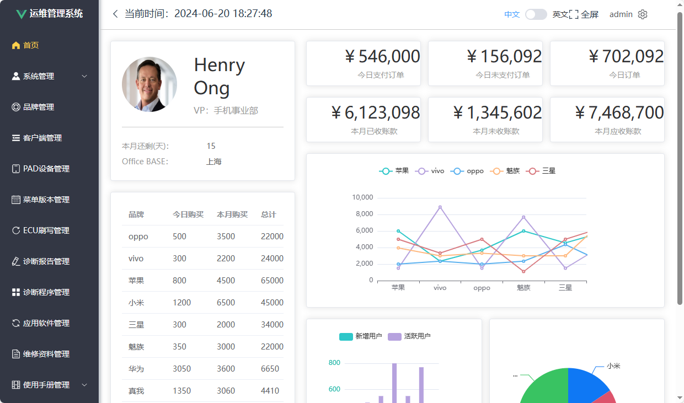

## **管理系统主页面设计和开发**

主题：

1. 主页？什么是主页 ？主页的作用是什么？
2. 应该如何设计？应该展示什么内容?
3. 如何实现？技术手段和支持？

## 小组

| 组号   | 组长             | 组员   | 组员   | 组员   | 组员   | 组员   | 公共任务  | 小组任务 |
| ------ | ---------------- | ------ | ------ | ------ | ------ | ------ | --------- | -------: |
| 第一组 | **鲍国立** | 闫宝童 | 任河   | 郑继桢 | 石鹏飞 | 应维鸿 | 1 2 3 8 9 |        4 |
| 第六组 | **刘瑀瑶** | 姜合心 | 叶佳惠 | 时佳怡 | 刘婧闻 |        | 1 2 3 8 9 |        4 |

## 目标

经典后台管理系统：DEMO一下

## 步骤

### 实现界面

https://echarts.apache.org/zh/index.html

### 实现功能

#### 创建数据库
把页面的数据抽象为数据库表，并通过Natice SQL语言实现数据库的创建.
#### 实现API

#### 调试

## 参考资料

`https://gitee.com/henryong/vite-crm-admin.git`

使用克隆命令： `git clone https://gitee.com/henryong/vite-crm-admin.git`
在 VS Code里打开，通过左下角 切换分支到 `8.2-home`

运行工程后，访问：[主页](http://localhost:5174/console)
