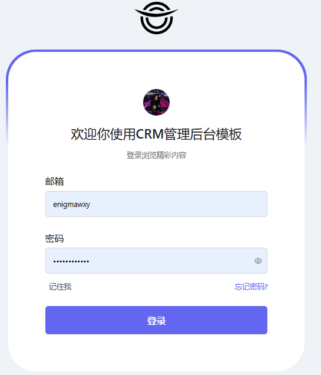
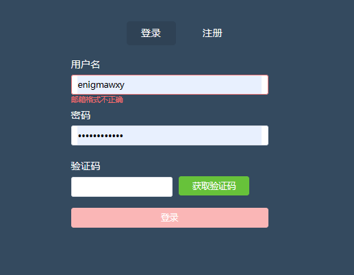

## **登录注册模块实现**

主题：

1. 为什么要登录注册?
2. 如何才是一个友好和合适的登录注册 界面？
3. 如何设计和实现登录注册？技术手段和 支持

## 任务小组

| 组号   | 组长             | 组员   | 组员   | 组员   | 组员   | 组员 | 公共任务  | 小组任务 |
| ------ | ---------------- | ------ | ------ | ------ | ------ | ---- | --------- | -------: |
| 第二组 | **刘尼尼** | 李月朋 | 张琦   | 王丹丹 | 张佳音 |      | 1 2 3 8 9 |        5 |
| 第七组 | **纪志雯** | 冯鑫   | 高新妍 | 李睿婷 |        |      | 1 2 3 8 9 |        5 |
| 第十组 | **康子情** | 李婉婷 | 魏昕   | 闫旭   |        |      | 1 2 3 8 9 |        5 |

## 目标

经典后台管理系统：DEMO一下

## 步骤

### 界面设计和实现

### 界面数据绑定和API调用

后端API平台：[http://47.92.157.229:8888/doc.html](http://47.92.157.229:8888/doc.html)

找到 管理接口 中的 员工类接口，学习并查看 登录接口，实现对接

## 参考资料

### 参考资料1：

`https://gitee.com/henryong/vite-crm-admin.git`

使用克隆命令： `git clone https://gitee.com/henryong/vite-crm-admin.git`
在 VS Code里打开，通过左下角 切换分支到 `8.2-home`

运行工程后，访问：[主页](http://localhost:5174/console)

### 参考资料2：

`https://gitee.com/teacher-wangs-warehouse/prime-vue-admin.git`

使用克隆命令： `git clone https://gitee.com/teacher-wangs-warehouse/prime-vue-admin.git`
在 VS Code里打开，通过左下角 切换分支到 `module.Login.0.3`

运行工程后，访问：[登录](http://localhost:5173/Login)
