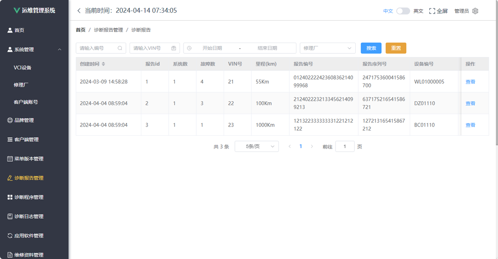
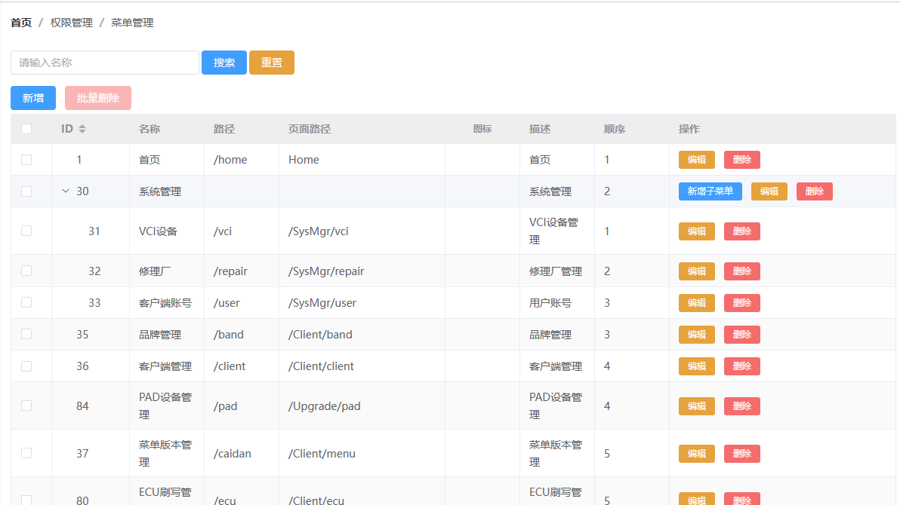
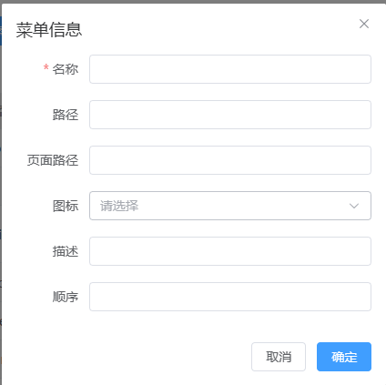
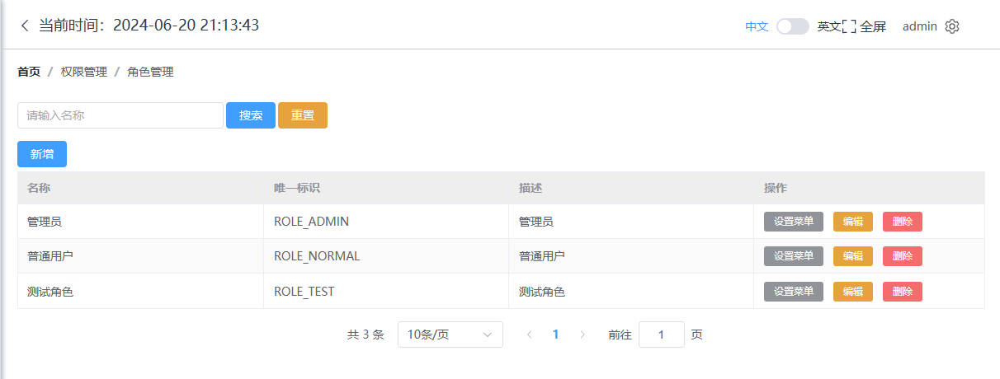
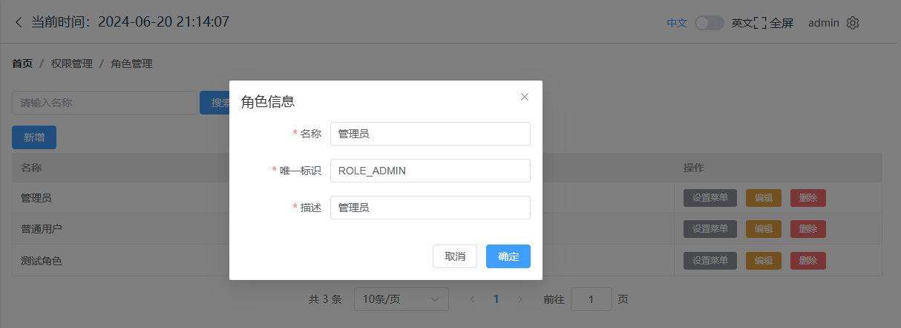
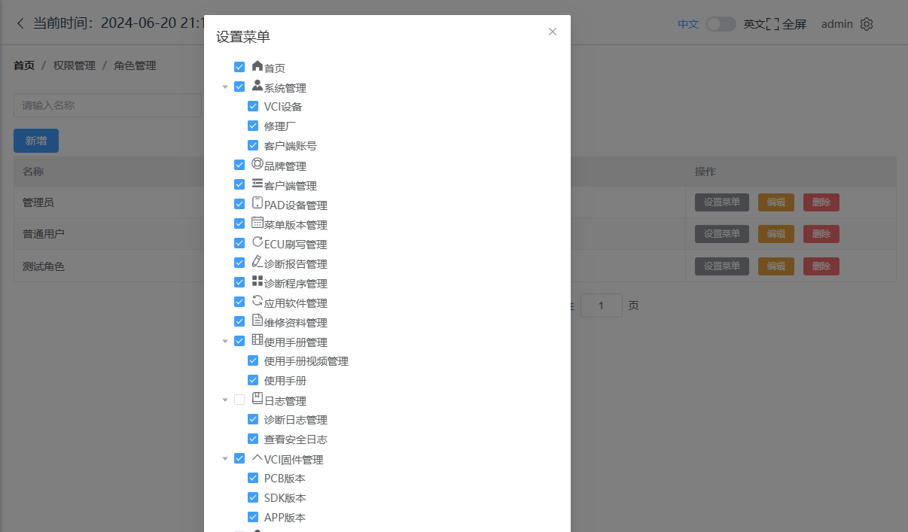

## **角色权限管理设计和实现**

主题：

1. 注销功能
2. 角色管理功能
3. 菜单管理功能

## 任务小组

| 组号   | 组长             | 组员   | 组员   | 组员   | 组员   | 组员 | 公共任务  | 小组任务 |
| ------ | ---------------- | ------ | ------ | ------ | ------ | ---- | --------- | -------: |
| 第三组 | **王一霖** | 赵冠雯 | 孔煜心 | 杜欣雨 |        |        | 1 2 3 8 9 |        6 |
| 第四组 | **陈幸**   | 李伊琳 | 郗思琪 | 金玉洁 | 李金馨 |        | 1 2 3 8 9 |        6 |
| 第八组   | **张佳鸣** | 晏文帝 | 侯向伦 | 李硕   | 王硕涵 | 魏俊杰 | 1 2 3 8 9 | 6        |
| 第九组   | **苏杭**   | 王相允 | 鲁施含 | 杨子萱 | 赵楠   | 张嘉航 | 1 2 3 8 9 | 6        |

## 目标

经典后台管理系统：DEMO一下



## 注销功能

### 引入Pinia模块

### 创建globalStore.js

```js
import { defineStore } from "pinia";
import router from "@/router";

export const useGlobalStore = defineStore("GlobalStore", {
  // state
  state: () => {
    return {
      currentPathName: "",
      base_url: "/web/",
    };
  },
  // actions
  actions: {
    setPath() {
      this.currentPathName = localStorage.getItem("currentPathName");
    },
    logout() {
      localStorage.removeItem("employee");
      localStorage.removeItem("menus");
      localStorage.removeItem("token");
      router.push("/login");
      //重置路由
      // resetRouter();
    },
  },
  // getters
});

```

### 在 Role.vue中引入

设置了角色菜单后，如果是管理员角色需要立即退出系统重新登录

```js
import { useGlobalStore } from "@/store"; 
const globalStore = useGlobalStore();
....
saveRoleMenu() {
  this.request.post("/roleMenu/" + this.roleId, this.$refs.tree.getCheckedKeys()).then(res => {
    if (res.code === 200) {
      ElMessage({
        showClose: true,
        type: 'success',
        message: '绑定成功',
        duration: 1000
      })
      this.menuDialogVisible = false
      //操作管理员角色后需要重新登录
      if (this.roleFlag === 'ROLE_ADMIN') {
        useGlobalStore().logout()
        // this.$store.commit("logout")
      }
    } else {
      ElMessage({
        showClose: true,
        type: 'error',
        message: '绑定失败',
        duration: 1000
      })
    }
  })
}
```

### 在Header.vue中引入

按照上述方法，修改Header.vue,实现 注销
并删除 Layout.vue中 用户信息错误代码

## 设计并完成 Menu.vue





## 设计并完成 Role.vue

主要包括以下界面和功能





