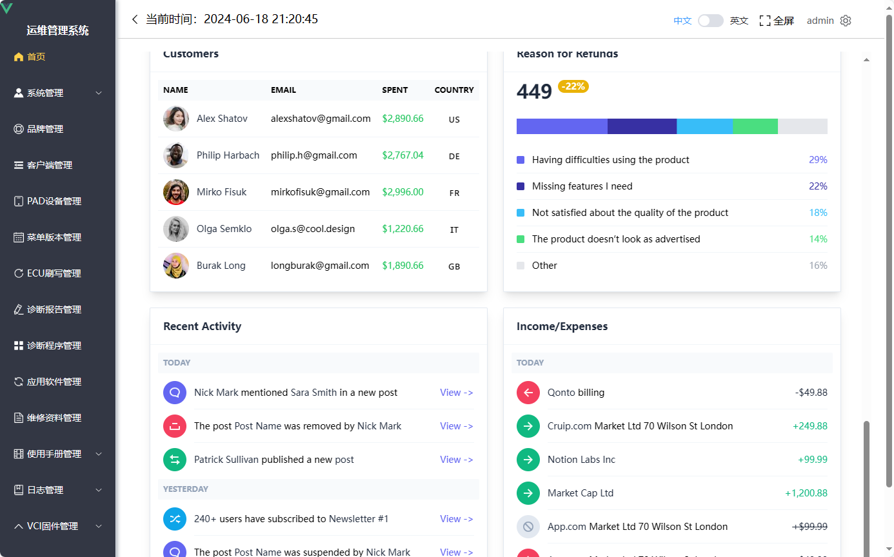

## **企业数据分析展示**

## 任务小组

| 组号     | 组长             | 组员   | 组员   | 组员   | 组员   | 组员   | 公共任务  | 小组任务 |
| -------- | ---------------- | ------ | ------ | ------ | ------ | ------ | --------- | -------: |
| 第五组   | **梁冬鑫** | 张鑫娜 | 张含溪 | 孟祥波 | 夏怡玮 | 刘怡君 | 1 2 3 8 9 |        7 |
| 第十一组 | **陈美霖** | 刘芳池 | 宋启燕 | 李成钰 | 王美悦 |        | 1 2 3 8 9 |        7 |

### 目标

通过管理后台，分析企业经营的状况，如图所示



## 需求分析

企业分析主要对于企业的销售额、费用等指标进行监控，并根据选择时间段对企业经营状态进行洞察：

## 步骤

### 布局设计和实现

主要采用 [Tailwind CSS - Rapidly build modern websites without ever leaving your HTML.](https://tailwindcss.com/) 和 绘图 [Chart.js | Open source HTML5 Charts for your website (chartjs.org)](https://www.chartjs.org/) 来完成。

### 增加Tailwind CSS库支持

参照这个链接 [Install Tailwind CSS with Vite - Tailwind CSS](https://tailwindcss.com/docs/guides/vite#vue)，完成 Tailwind的安装和初步设置。

### 安装Chart.js等依赖

`npm i chart.js chartjs-adapter-moment vue-flatpickr-component `

### 拷贝相关资源目录

拷贝：css，images到 src 目录下

拷贝： Utils.js 到 utils目录下

拷贝：charts目录到 src/views 目录下

拷贝：components 目录到 src/views 目录下

拷贝：partials 目录到 src/views 目录下

### 创建 Dashboard.vue

其中敲入如下代码：

```js
<template>
  <div class="flex h-screen overflow-hidden">
    <!-- Content area -->
    <div class="relative flex flex-col flex-1 overflow-y-auto overflow-x-hidden">
      <main>
        <div class="px-4 sm:px-6 lg:px-8 py-8 w-full max-w-9xl mx-auto">

          <!-- Welcome banner -->
          <WelcomeBanner />

          <!-- Dashboard actions -->
          <div class="sm:flex sm:justify-between sm:items-center mb-8">

            <!-- Left: Avatars -->
            <DashboardAvatars />

            <!-- Right: Actions -->
            <div class="grid grid-flow-col sm:auto-cols-max justify-start sm:justify-end gap-2">

              <!-- Filter button -->
              <FilterButton align="right" />
              <!-- Datepicker built with flatpickr -->
              <Datepicker align="right" />
              <!-- Add view button -->
              <button class="btn bg-indigo-500 hover:bg-indigo-600 text-white">
                <svg class="w-4 h-4 fill-current opacity-50 shrink-0" viewBox="0 0 16 16">
                  <path
                    d="M15 7H9V1c0-.6-.4-1-1-1S7 .4 7 1v6H1c-.6 0-1 .4-1 1s.4 1 1 1h6v6c0 .6.4 1 1 1s1-.4 1-1V9h6c.6 0 1-.4 1-1s-.4-1-1-1z" />
                </svg>
                <span class="hidden xs:block ml-2">Add view</span>
              </button>
            </div>

          </div>

          <!-- Cards -->
          <div class="grid grid-cols-12 gap-6">

            <!-- Line chart (Acme Plus) -->
            <DashboardCard01 />
            <!-- Line chart (Acme Advanced) -->
            <DashboardCard02 />
            <!-- Line chart (Acme Professional) -->
            <DashboardCard03 />
            <!-- Bar chart (Direct vs Indirect) -->
            <DashboardCard04 />
            <!-- Line chart (Real Time Value) -->
            <DashboardCard05 />
            <!-- Doughnut chart (Top Countries) -->
            <DashboardCard06 />
            <!-- Table (Top Channels) -->
            <DashboardCard07 />
            <!-- Line chart (Sales Over Time) -->
            <DashboardCard08 />
            <!-- Stacked bar chart (Sales VS Refunds) -->
            <DashboardCard09 />
            <!-- Card (Customers)  -->
            <DashboardCard10 />
            <!-- Card (Reasons for Refunds)   -->
            <DashboardCard11 />
            <!-- Card (Recent Activity) -->
            <DashboardCard12 />
            <!-- Card (Income/Expenses) -->
            <DashboardCard13 />

          </div>

        </div>
      </main>
    </div>
  </div>
</template>

<script>
import WelcomeBanner from '@/views/partials/dashboard/WelcomeBanner.vue'
import DashboardAvatars from '@/views/partials/dashboard/DashboardAvatars.vue'
import FilterButton from '@/views/components/DropdownFilter.vue'
import Datepicker from '@/views/components/Datepicker.vue'
import DashboardCard01 from '@/views/partials/dashboard/DashboardCard01.vue'
import DashboardCard02 from '@/views/partials/dashboard/DashboardCard02.vue'
import DashboardCard03 from '@/views/partials/dashboard/DashboardCard03.vue'
import DashboardCard04 from '@/views/partials/dashboard/DashboardCard04.vue'
import DashboardCard05 from '@/views/partials/dashboard/DashboardCard05.vue'
import DashboardCard06 from '@/views/partials/dashboard/DashboardCard06.vue'
import DashboardCard07 from '@/views/partials/dashboard/DashboardCard07.vue'
import DashboardCard08 from '@/views/partials/dashboard/DashboardCard08.vue'
import DashboardCard09 from '@/views/partials/dashboard/DashboardCard09.vue'
import DashboardCard10 from '@/views/partials/dashboard/DashboardCard10.vue'
import DashboardCard11 from '@/views/partials/dashboard/DashboardCard11.vue'
import DashboardCard12 from '@/views/partials/dashboard/DashboardCard12.vue'
import DashboardCard13 from '@/views/partials/dashboard/DashboardCard13.vue'

export default {
  name: 'Dashboard',
  components: {
    WelcomeBanner,
    DashboardAvatars,
    FilterButton,
    Datepicker,
    DashboardCard01,
    DashboardCard02,
    DashboardCard03,
    DashboardCard04,
    DashboardCard05,
    DashboardCard06,
    DashboardCard07,
    DashboardCard08,
    DashboardCard09,
    DashboardCard10,
    DashboardCard11,
    DashboardCard12,
    DashboardCard13,
  }
}
</script>
```

### 调整样式

在入口 `main.js` 加入,

```js
import './css/style.css'
```

去掉来的其它css的引入。

### 实现功能

#### 创建数据库

\src\views\partials
每个组件的数据库都需要创建，如：

```js
// DashboardCard01.vue
const chartData = ref({
  labels: [
    '12-01-2020', '01-01-2021', '02-01-2021',
    '03-01-2021', '04-01-2021', '05-01-2021',
    '06-01-2021', '07-01-2021', '08-01-2021',
    '09-01-2021', '10-01-2021', '11-01-2021',
    '12-01-2021', '01-01-2022', '02-01-2022',
    '03-01-2022', '04-01-2022', '05-01-2022',
    '06-01-2022', '07-01-2022', '08-01-2022',
    '09-01-2022', '10-01-2022', '11-01-2022',
    '12-01-2022', '01-01-2023',
  ],
  datasets: [
    // Indigo line
    {
      data: [
        732, 610, 610, 504, 504, 504, 349,
        349, 504, 342, 504, 610, 391, 192,
        154, 273, 191, 191, 126, 263, 349,
        252, 423, 622, 470, 532,
      ],
      fill: true,
      backgroundColor: `rgba(${hexToRGB(tailwindConfig().theme.colors.blue[500])}, 0.08)`,
      borderColor: tailwindConfig().theme.colors.indigo[500],
      borderWidth: 2,
      tension: 0,
      pointRadius: 0,
      pointHoverRadius: 3,
      pointBackgroundColor: tailwindConfig().theme.colors.indigo[500],
      pointHoverBackgroundColor: tailwindConfig().theme.colors.indigo[500],
      pointBorderWidth: 0,
      pointHoverBorderWidth: 0,        
      clip: 20,
    },
    // Gray line
    {
      data: [
        532, 532, 532, 404, 404, 314, 314,
        314, 314, 314, 234, 314, 234, 234,
        314, 314, 314, 388, 314, 202, 202,
        202, 202, 314, 720, 642,
      ],
      borderColor: `rgba(${hexToRGB(tailwindConfig().theme.colors.slate[500])}, 0.25)`,
      borderWidth: 2,
      tension: 0,
      pointRadius: 0,
      pointHoverRadius: 3,
      pointBackgroundColor: `rgba(${hexToRGB(tailwindConfig().theme.colors.slate[500])}, 0.25)`,
      pointHoverBackgroundColor: `rgba(${hexToRGB(tailwindConfig().theme.colors.slate[500])}, 0.25)`,
      pointBorderWidth: 0,
      pointHoverBorderWidth: 0,             
      clip: 20,
    },
  ],
})
```

把X，Y轴的数据，拿出来，创建成表，然后在组件中调用。

#### 实现API

#### 调试

### 参考资料

https://chartjs.cn/

https://github.com/cruip/vuejs-admin-dashboard-template
